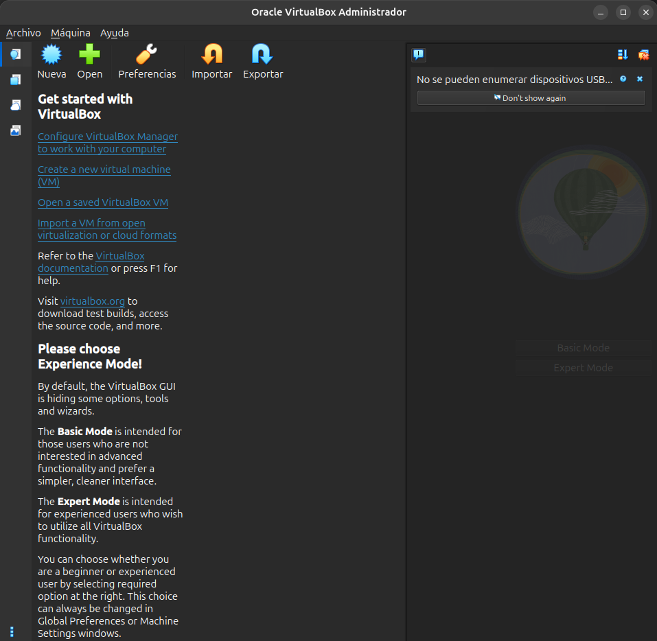
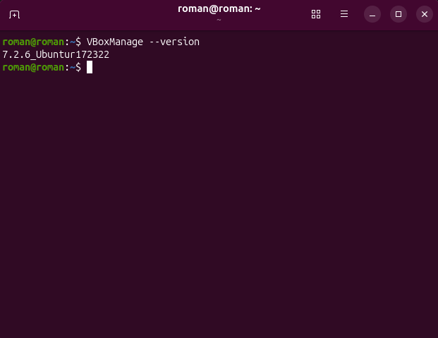
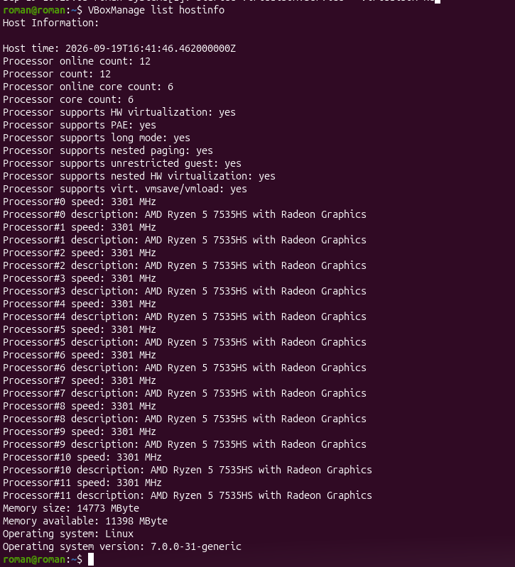

# Evidencias Práctica 1 - VirtualBox

### Evidencia 1 - VirtualBox abierto

### Evidencia 2 - Versión

### Evidencia 3 - Información del host

### Registro de instalación
| Dato | Resultado |
|---|---|
| Nombre del alumno | Carlos Román García Martínez |
| Fecha | 19 de septiembre de 2026 |
| Versión de Ubuntu | Ubuntu 26.04 LTS |
| Arquitectura | x86_64 |
| Versión de VirtualBox | 7.2.6_Ubuntu r172322 |
| Instalación exitosa | ☑ Sí ☐ No |
