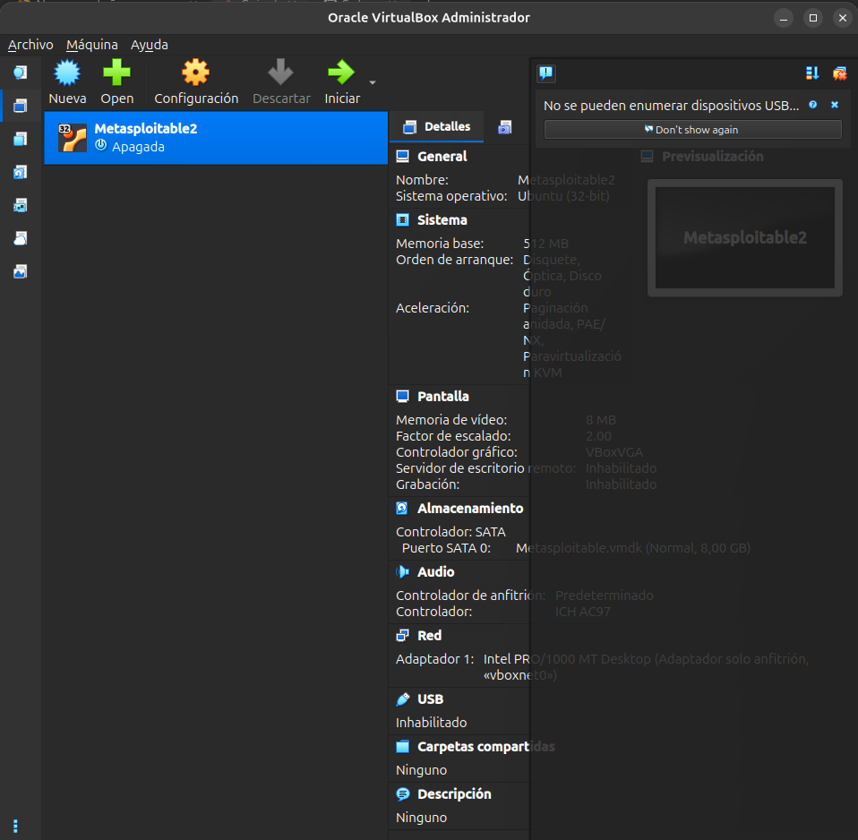
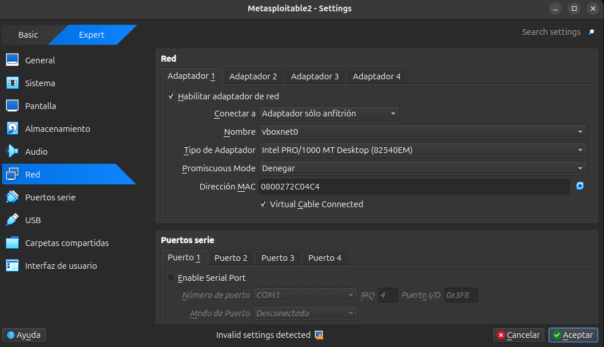
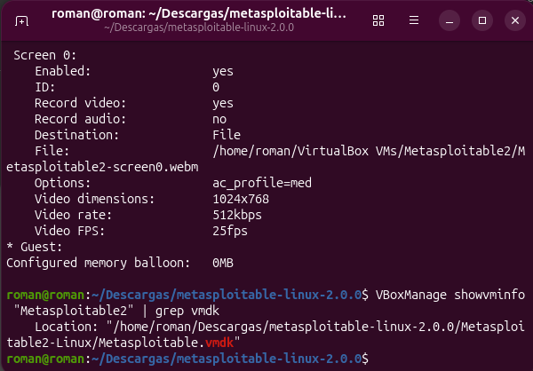
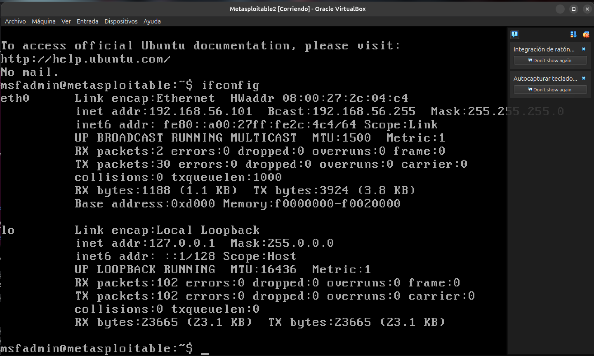
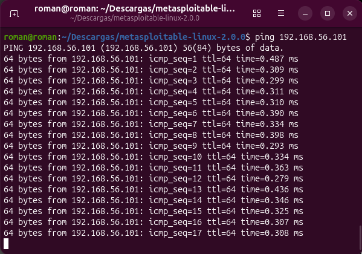
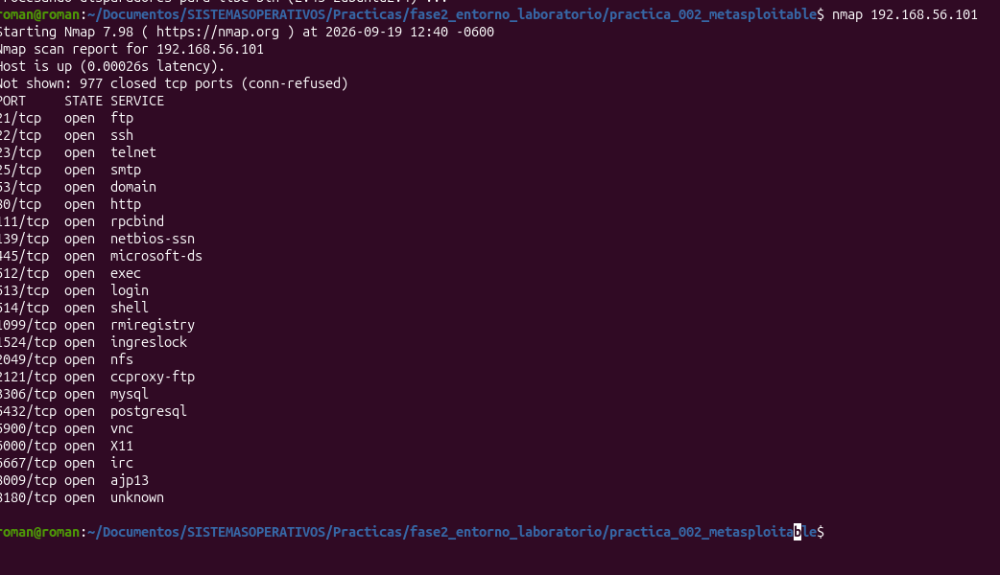

# Evidencias Práctica 2 - Metasploitable 2

### Evidencia 1 - VirtualBox

### Evidencia 2 - Configuración de red

### Evidencia 3 - VMDK

### Evidencia 4 - IP

### Evidencia 5 - Comunicación

### Evidencia 6 - Nmap

### Tabla de registro
| Dato | Resultado |
|---|---|
| Alumno | Carlos Román García Martínez |
| Fecha | 19 de septiembre de 2026 |
| Ubuntu | 192.168.56.1 |
| VirtualBox | (Tu versión instalada) |
| Metasploitable | `Metasploitable2` |
| RAM | 512 MB |
| CPU | 1 |
| Disco | `Metasploitable.vmdk` |
| Red | Host-Only |
| Interfaz | `vboxnet0` |
| IP Host | `192.168.56.1` |
| IP Metasploitable | (La IP que te dio ifconfig) |
| Ping | ☑ Exitoso ☐ Fallido |
| Nmap | ☑ Exitoso ☐ Fallido |
