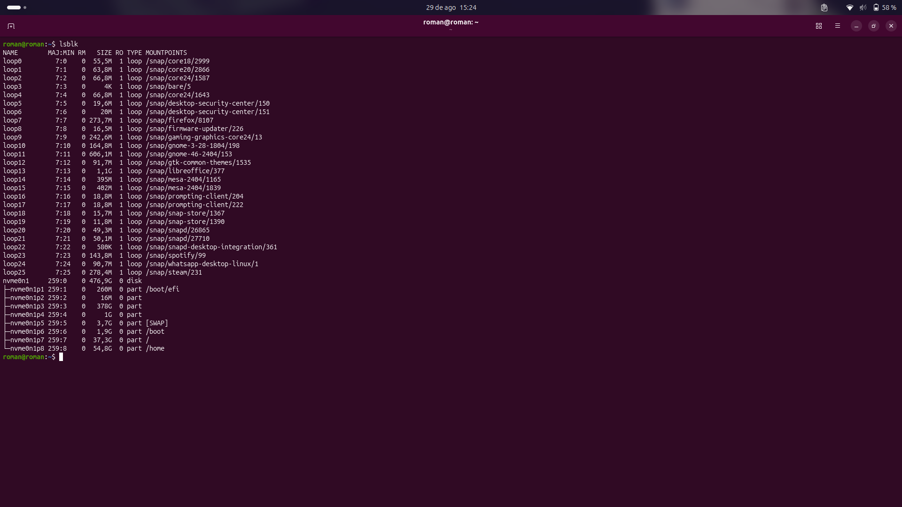

# Semana 01 - Sistemas Operativos

## 🎯 Objetivo
Diagnosticar el almacenamiento en Ubuntu utilizando la terminal, diferenciando discos, particiones y sistemas de archivos de manera segura[cite: 1].

## 🐧 Entorno
Distribución Ubuntu, arquitectura x86_64, operando con usuario estándar y privilegios sudo[cite: 1].
*Comando:* `cat /etc/os-release && uname -m && whoami`[cite: 1]

> **Descripción:** Aquí va la imagen de tu terminal mostrando la versión exacta de Ubuntu, la arquitectura del sistema y tu nombre de usuario.

## 💽 Diagnóstico del almacenamiento
Se identificó el disco físico principal y su capacidad total[cite: 1].
*Comando:* `lsblk`[cite: 1]

> **Descripción:** Aquí va la imagen mostrando el árbol de dispositivos de almacenamiento, donde se aprecia el disco principal y sus tamaños.

## 🧩 Particiones
Se reconocieron las divisiones lógicas dependientes del disco principal y la función que parece cumplir cada una[cite: 1].

> **Descripción:** Aquí va la imagen (puede ser un recorte de `lsblk` o `fdisk`) donde se distingan claramente las particiones creadas, como la de arranque, la de Linux y/o la de Windows.

## 🗂️ Sistemas de archivos
Se obtuvieron los formatos FSTYPE y los identificadores persistentes UUID mediante la información de la terminal[cite: 1].
*Comando:* `lsblk -f`[cite: 1]

> **Descripción:** Aquí va la imagen de la salida del comando que muestra las columnas adicionales con el tipo de sistema de archivos (ext4, vfat, ntfs, etc.) y los UUID de cada partición.

## 🔎 Herramientas utilizadas
*   **lsblk:** Muestra la jerarquía de bloques para ver la estructura general[cite: 1].
*   **lsblk -f:** Muestra FSTYPE y UUID para identificar formatos y montajes[cite: 1].
*   **fdisk -l:** Muestra sectores y tabla (GPT) para auditoría de bajo nivel[cite: 1].

*Comando:* `sudo fdisk -l`[cite: 1]

> **Descripción:** Aquí va la imagen con la salida de `fdisk`, detallando los sectores de inicio y fin, el tamaño en bytes y el tipo de tabla de particiones (GPT/MBR).

## 🥾 EFI / UEFI
Se encontró que el equipo posee partición de arranque `vfat` gestionada por UEFI[cite: 1]. Su función es la inicialización del sistema[cite: 1].

## 🔄 GPT / MBR
Se investigó y verificó el uso del estándar GPT en el equipo[cite: 1].

## 🔐 BitLocker
Detectado en el entorno de Windows; requiere precaución extrema para no corromper la tabla de acceso cifrada según lo investigado[cite: 1].

## 🗺️ Mapa del almacenamiento

    💻 DISCO PRINCIPAL
         ├── 🥾 EFI (vfat)
         ├── 🪟 WIN (ntfs)
         └── 🐧 LINUX (ext4)

## 💾 Laboratorio
Se identificó el dispositivo virtual indicado para el laboratorio[cite: 1]. El cambio realizado fue la creación de una partición de prueba[cite: 1]. El resultado se verificó observando la salida de los comandos antes y después de la operación[cite: 1].

## 🧪 Antes y después
El disco virtual comenzó sin particiones; después de la operación controlada, se reflejó la nueva partición con su respectivo tamaño[cite: 1].

> **Descripción:** Aquí va la imagen o secuencia de imágenes que demuestran el estado inicial del disco virtual, el comando utilizado para modificarlo, y el estado final con la partición de prueba ya creada.

## ⚠️ Seguridad
Los riesgos de trabajar con discos y particiones incluyen la pérdida total de datos si se ejecutan operaciones destructivas sobre el disco principal del equipo[cite: 1].

## 💭 Reflexión final
Aprendí que el diagnóstico de bajo nivel en terminal es fundamental para comprender la infraestructura física del equipo y administrar los recursos sin depender de interfaces gráficas, mitigando riesgos operativos[cite: 1].
