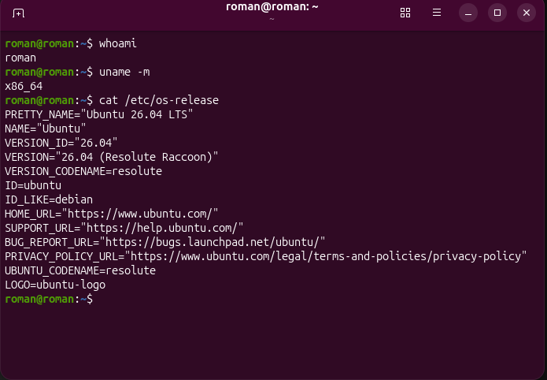
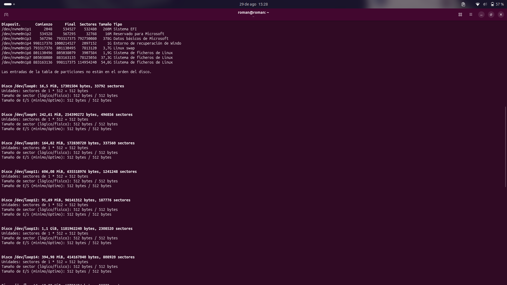
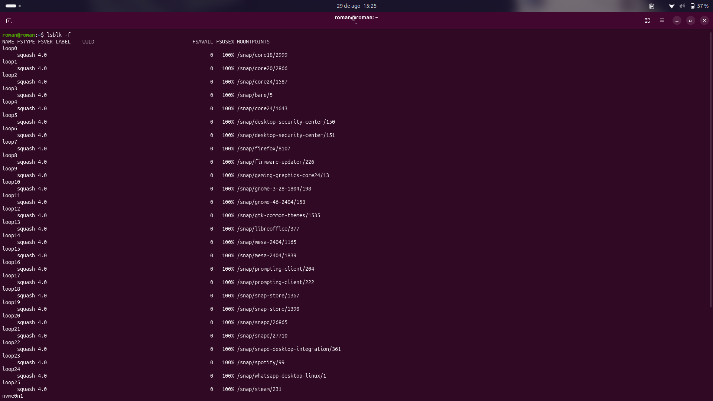
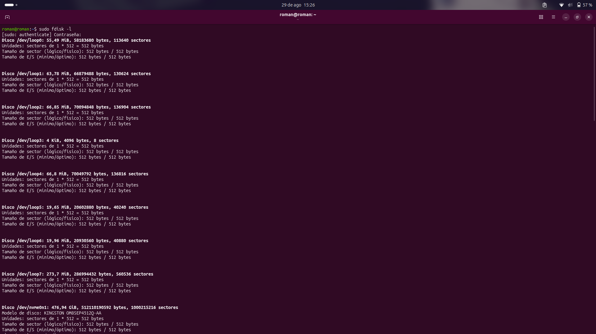

# Semana 01 - Sistemas Operativos

## 🎯 Objetivo
Diagnosticar el almacenamiento en Ubuntu utilizando la terminal, diferenciando discos, particiones y sistemas de archivos de manera segura.

## 🐧 Entorno
Distribución Ubuntu, arquitectura x86_64, operando con usuario estándar y privilegios sudo.
*Comando:* `cat /etc/os-release && uname -m && whoami`

> **Descripción:** Captura mostrando la versión exacta de Ubuntu, la arquitectura del sistema y el nombre de usuario.

## 💽 Diagnóstico del almacenamiento
Se identificó el disco físico principal y su capacidad total.
*Comando:* `lsblk`

> **Descripción:** Captura mostrando el árbol de dispositivos de almacenamiento, donde se aprecia el disco principal y sus tamaños.

## 🧩 Particiones
Se reconocieron las divisiones lógicas dependientes del disco principal y la función que parece cumplir cada una.

> **Descripción:** Captura donde se distinguen claramente las particiones creadas, como la de arranque, la de Linux y/o la de Windows.

## 🗂️ Sistemas de archivos
Se obtuvieron los formatos FSTYPE y los identificadores persistentes UUID mediante la información de la terminal.
*Comando:* `lsblk -f`

> **Descripción:** Captura de la salida del comando que muestra las columnas adicionales con el tipo de sistema de archivos (ext4, vfat, ntfs, etc.) y los UUID de cada partición.

## 🔎 Herramientas utilizadas
| Herramienta | ¿Qué investigué? | ¿Qué información obtuve? | ¿Para qué me sirve? |
|---|---|---|---|
| `lsblk` | Jerarquía de dispositivos de bloques. | Árbol lógico de discos, ramificaciones de particiones y tamaños asignados. | Para identificar rápidamente la estructura física y lógica del almacenamiento sin modificar nada. |
| `lsblk -f` | Metadatos y sistemas de archivos. | Tipos de formatos (FSTYPE), etiquetas y UUID de cada partición. | Para conocer el formato de cada unidad y obtener el identificador persistente necesario para montajes. |
| `fdisk -l`| Estructura a nivel de sectores. | Tipo de tabla (GPT/MBR), sectores de inicio/fin y tamaño exacto en bytes. | Para realizar auditorías de bajo nivel, verificar alineación y confirmar los límites físicos. |
| `parted -l`| Geometría avanzada y banderas. | Esquema de particiones detallado, sistemas de archivos y *flags* (como `boot` o `esp`). | Para diagnosticar problemas de arranque y leer la tabla de discos de gran capacidad. |
| `blkid`| Atributos directos a nivel de bloque. | UUID, TYPE (sistema de archivos) y PARTUUID de manera aislada. | Para extraer identificadores universales rápidos al configurar el archivo de autoarranque `/etc/fstab`. |

*Comando:* `sudo fdisk -l`

> **Descripción:** Captura con la salida de `fdisk`, detallando los sectores de inicio y fin, el tamaño en bytes y el tipo de tabla de particiones.

## 🥾 EFI / UEFI
Se encontró que el equipo posee partición de arranque `vfat` gestionada por UEFI. Su función es la inicialización del sistema.

## 🔄 GPT / MBR
Se investigó y verificó el uso del estándar GPT en el equipo.

## 🔐 BitLocker
Detectado en el entorno de Windows; requiere precaución extrema para no corromper la tabla de acceso cifrada según lo investigado.

## 🗺️ Mapa del almacenamiento

    💻 DISCO PRINCIPAL
         ├── 🥾 EFI (vfat)
         ├── 🪟 WIN (ntfs)
         └── 🐧 LINUX (ext4)

## 💾 Laboratorio
Para esta práctica no se proporcionó un disco virtual o entorno de laboratorio seguro, por lo que no se realizó ninguna operación de creación o formateo de particiones de prueba. El particionado del disco principal se realizó previamente como requisito para la instalación del sistema operativo Ubuntu. Por lo tanto, el trabajo en esta sesión se limitó a la observación y diagnóstico seguro de la estructura ya existente.

## 🧪 Antes y después
Esta sección no aplica para la entrega. No se ejecutaron operaciones de modificación en tiempo real, respetando la regla de seguridad de no alterar el disco principal del equipo.

## ⚠️ Seguridad
Durante la práctica se respetó la instrucción de no ejecutar comandos destructivos sobre el disco principal. Los riesgos de trabajar con discos reales incluyen la pérdida total de datos, la corrupción del gestor de arranque (EFI) o la destrucción de particiones de Windows (riesgo agravado si utilizan cifrado BitLocker).

## 💭 Reflexión final
Aprendí que el diagnóstico de bajo nivel en terminal es fundamental para comprender la infraestructura física del equipo. Al analizar cómo quedó estructurado mi propio disco tras la instalación de Ubuntu, comprobé la importancia de saber interpretar las herramientas de lectura para auditar el sistema con seguridad, sin depender de interfaces gráficas y mitigando riesgos operativos.
