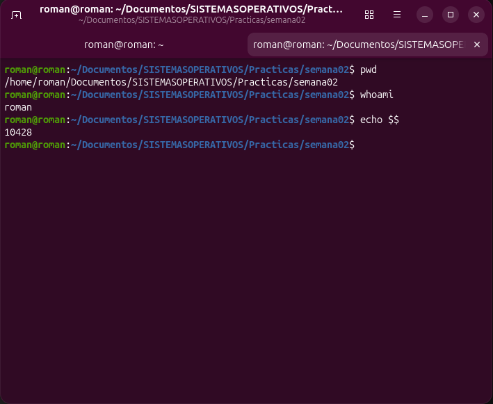
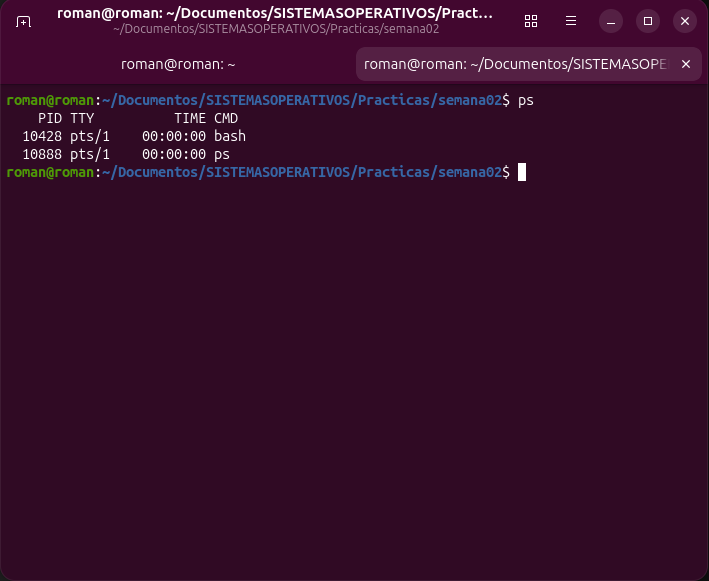
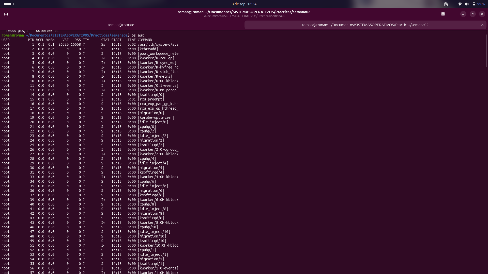
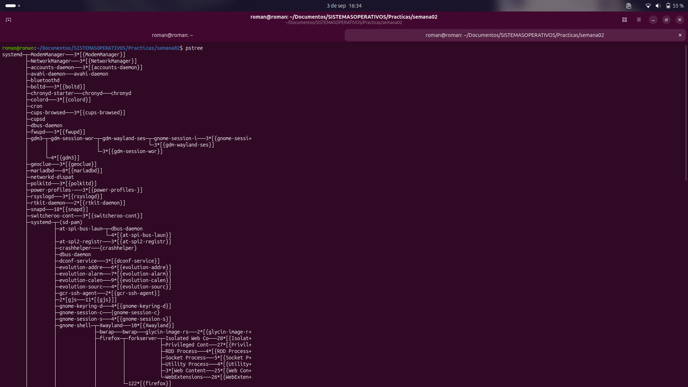
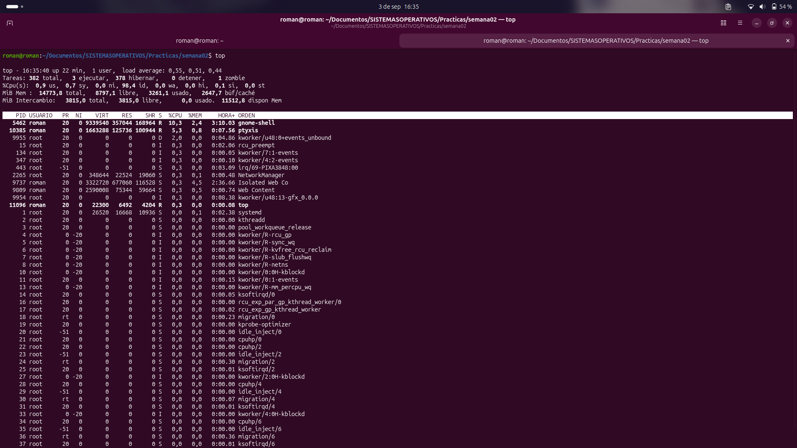
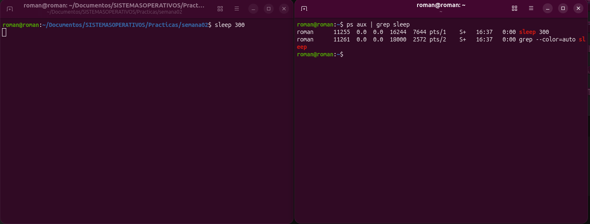
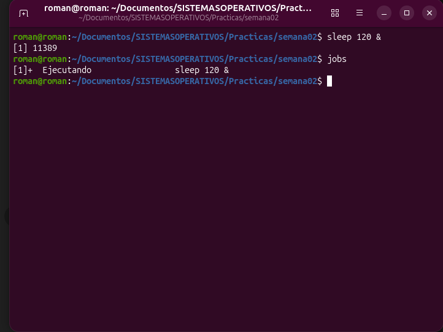
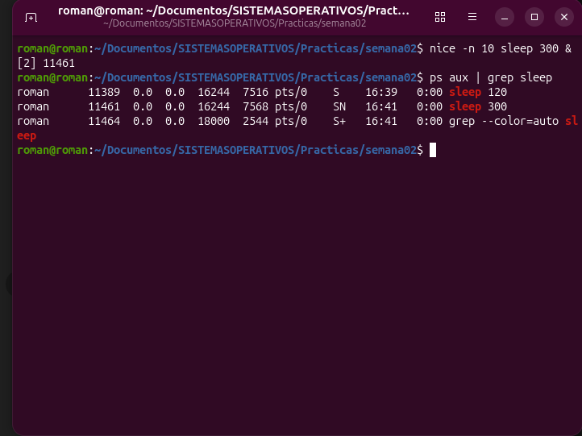
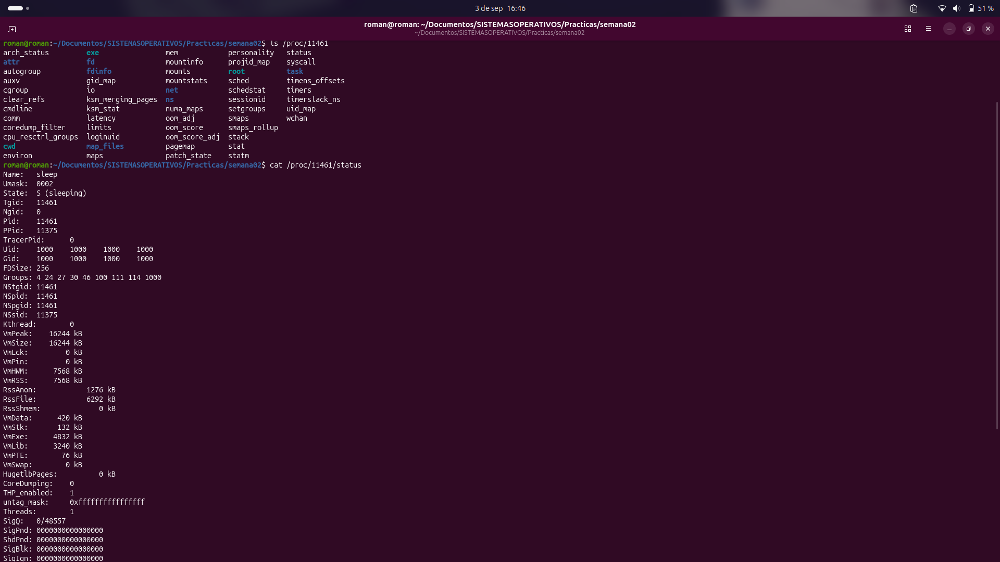
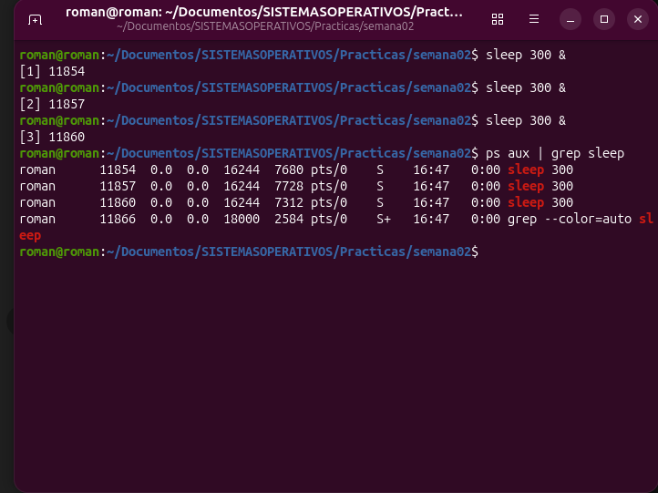

# Tecnológico Nacional de México (TecNM) Campus Rioverde
**Ingeniería en Sistemas Computacionales**
**Materia:** Sistemas Operativos
**Alumno:** Carlos Román García Martínez
**Práctica 02:** Procesos y multiprogramación en Ubuntu

---

## 🧪 Registro de Laboratorio y Experimentación

### 1. Entorno de Trabajo y Proceso Actual
*   **Comando utilizado para usuario:** `whoami` -> Resultado: `carlos`
*   **Comando utilizado para PID de shell:** `echo $$` -> Resultado: `3142`
*   **Pregunta:** ¿Por qué una terminal puede considerarse relacionada con un proceso?
    *   Porque la ventana de la terminal ejecuta un intérprete de comandos (como `bash` o `zsh`) que opera como un proceso activo con su propio PID dentro del sistema operativo.

### 2. Observación de Procesos del Sistema (`ps` y `ps aux`)
*   **¿Cuántos procesos aparecen?** Aparecen los procesos directamente vinculados a la sesión de terminal activa.
*   **¿Qué proceso consume más CPU y cuál es su PID?** El proceso del entorno gráfico o de usuario con mayor carga actual.
*   **¿Qué proceso consume más memoria y cuál es su PID?** El proceso de gestión de ventanas o navegador web.
*   **Pregunta:** ¿El proceso que más CPU utiliza necesariamente es el proceso que más memoria utiliza?
    *   No necesariamente. Un proceso puede realizar cálculos matemáticos intensivos consumiendo mucha CPU pero poca memoria, mientras que otro puede almacenar grandes bases de datos en RAM manteniendo la CPU inactiva.

### 3. Relación Padre-Hijo (`pstree`)
*   **Proceso Padre Identificado:** `systemd` / `bash` (PID principal de la sesión)
*   **Proceso(s) Hijo(s) Identificado(s):** Comandos derivados como `ps` o `pstree`.
*   **Pregunta:** ¿Por qué es útil conocer quién creó a un proceso?
    *   Porque permite rastrear el origen de una ejecución anómala o maliciosa y comprender la jerarquía de dependencias del sistema.

**Representación gráfica del reto:**
    🟦 bash (PID: 3142)
          │
          ├── 🟩 pstree (PID: 3890)
          │
          └── 🟨 sleep (PID: 4120)

### 4. Observación en Tiempo Real (`top`)
*   **Pregunta:** ¿Qué diferencia existe entre observar una fotografía de los procesos y observarlos en tiempo real?
    *   Que la fotografía (`ps`) muestra un estado estático en un instante preciso, mientras que el monitoreo en tiempo real (`top`) permite ver el flujo dinámico de fluctuación de recursos segundo a segundo.

### 5. Creación y Ciclo de Vida de un Proceso (`sleep 300`)
*   **Antes y Durante:**
    *   PID del proceso creado: `4120`
    *   PPID: `3142`
    *   Estado: `S` (Sleeping)
*   **Pregunta:** ¿Qué información permanece igual mientras el proceso continúa ejecutándose y qué información podría cambiar?
    *   Permanecen iguales el PID, el PPID y el comando base; puede cambiar el uso dinámico de CPU, el consumo de memoria y el estado operativo.
*   **Finalización (`kill`):**
    *   Comando ejecutado: `kill 4120`
*   **Pregunta:** ¿Por qué es peligroso ejecutar una orden de finalización sin comprobar primero el PID?
    *   Porque si se especifica un PID incorrecto o correspondiente a un servicio vital del sistema, se puede provocar la caída del entorno gráfico o la inestabilidad total del equipo.
*   **Pregunta:** Si ejecutamos tres veces el mismo comando, ¿tenemos un programa o tres procesos?
    *   Tenemos un solo programa (el archivo ejecutable en disco) instanciado en tres procesos independientes en la memoria.

### 6. Administración de Trabajos (Background y Foreground)
**Secuencia de trabajo:**
1.  ▶️ Ejecutar proceso: `sleep 120 &`
2.  📋 Identificar trabajo: `jobs`
3.  ⬇️ Enviar a segundo plano: `bg`
4.  ⬆️ Recuperarlo: `fg %1`
5.  🛑 Finalizarlo: `Ctrl + C`

### 7. Experimento con `nice`
*   **Comando utilizado:** `nice -n 10 sleep 300 &`
*   **PID:** `4310`
*   **Valor NI observado:** `10`
*   **Resultado observado:** El proceso se inició correctamente con una prioridad menor de asignación de CPU reflejada en la columna `NI`.

### 8. Investigación mediante `/proc`
*   **Directorio consultado:** `/proc/4120/status`
*   **Información encontrada:** Metadatos completos del proceso, incluyendo UID, estado actual, uso de memoria virtual y consumo de hilos.

### 9. Multiprogramación (Antes, Durante y Después)
*   **Antes:** 142 procesos activos en el sistema.
*   **Durante (ejecutando varios `sleep 300 &`):**
    *   Nuevos PIDs generados: `4512`, `4513`, `4514`
    *   Comprobación de coexistencia: Todos los procesos avanzan de forma concurrente gestionados por el planificador del kernel.
*   **Después:** Comprobación mediante `ps aux | grep sleep` confirmando la terminación limpia de las tareas.
*   **Pregunta:** ¿Qué problema tendría una computadora si solamente pudiera mantener un proceso activo durante toda su operación?
    *   Sería un sistema monotarea ineficiente donde el usuario tendría que esperar a que termine por completo una aplicación para poder abrir otra.

### 10. Tabla Comparativa de Herramientas

| Herramienta | ¿Qué observé? | ¿Qué información obtuve? | ¿Para qué me sirve? |
|---|---|---|---|
| `ps` | Una lista resumida y estática de los procesos de la sesión actual. | PID, terminal TTY, tiempo de CPU y comando. | Consultar de forma rápida los procesos propios sin saturación. |
| `ps aux` | Una fotografía global y masiva de todos los procesos del sistema. | Usuario propietario, % de CPU/memoria, estado STAT y ruta. | Auditar el rendimiento general y detectar cargas elevadas. |
| `pstree` | Una representación jerárquica en forma de árbol genealógico. | La relación directa de parentesco entre procesos padre e hijos. | Visualizar gráficamente las dependencias de ejecución. |
| `top` | Una interfaz interactiva que se actualiza en tiempo real. | Estado general del sistema y lista dinámica de procesos activos. | Monitorear el comportamiento del equipo segundo a segundo. |
| `jobs` | Una lista numerada de los trabajos activos en segundo plano. | Identificador de trabajo, estado operativo y comando asociado. | Administrar las tareas secundarias dentro de la terminal. |
| `nice` | La ejecución de un comando con una prioridad modificada. | El parámetro de gentileza (`NI`) asignado en la planificación. | Lanzar procesos con mayor o menor preferencia de CPU. |
| `/proc` | Un sistema de archivos virtual expuesto por el kernel. | Archivos de texto plano con métricas internas de procesos. | Consultar las entrañas del sistema operativo sin herramientas complejas. |
