# 🕵️ Semana 04 — Investigación de seguridad

## 👤 Alumno
Carlos Román García Martínez

## 📅 Fecha
3 de octubre de 2026

## 🖥️ Sistema anfitrión
Ubuntu

## 🧪 Máquina objetivo
Metasploitable 2

## 🌐 Red
Host-Only

## 📡 IP Ubuntu
192.168.56.1

## 🎯 IP Metasploitable
192.168.56.101

## 🔎 Servicios encontrados
* FTP (21)
* SSH (22)
* Telnet (23)
* HTTP (80)
* MySQL (3306)
* PostgreSQL (5432)
* VNC (5900)

## 🔐 Usuario utilizado
`msfadmin`

## 👥 Grupos identificados
* `msfadmin`
* `admin`
* `adm`

## 🔒 Análisis de permisos
Se detectaron permisos altamente permisivos en servicios de red y configuraciones vulnerables, además de archivos con el bit SUID activado que requieren auditoría.

## 🚨 Hallazgos
Exposición masiva de protocolos inseguros en texto plano (Telnet, FTP, Shell), uso de cuentas con credenciales predeterminadas (`msfadmin`) y bases de datos expuestas a la red (MySQL, PostgreSQL).

## 🛡️ Medidas de protección
1. Deshabilitar Telnet y utilizar SSH para conexiones remotas.
2. Evitar contraseñas débiles y eliminar cuentas innecesarias.
3. Utilizar firewall y evitar exponer bases de datos y servidores VNC.
4. Auditar SUID y revisar propietarios de archivos sensibles.
5. Evitar permisos `777` y aplicar el principio de mínimo privilegio.

## 🧠 Conclusión
Los usuarios, grupos y permisos son una parte fundamental de la seguridad en un sistema Linux. Una mala configuración en los permisos puede aumentar drásticamente el nivel de riesgo, permitiendo accesos no autorizados a información confidencial o escalación de privilegios.

---

# 📸 Evidencias Fotográficas

### 📦 Evidencia 01 - Preparación del entorno (vboxnet0)
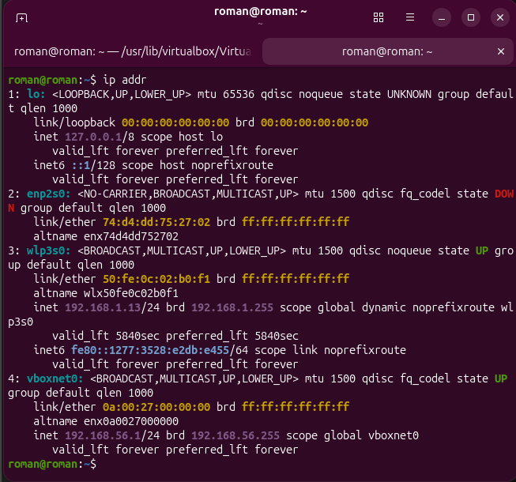

### 🌐 Evidencia 02 - Descubrimiento de red con Nmap
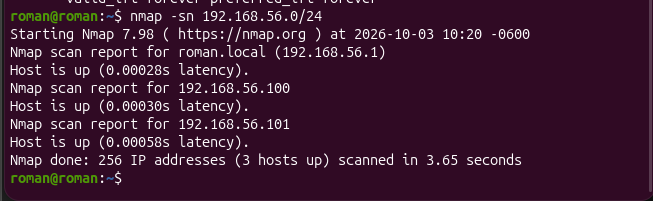

### ⚡ Evidencia 03 - Comprobación de conectividad (Ping)
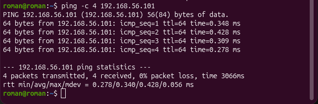

### 🔍 Evidencia 04 - Reconocimiento de servicios (Nmap)
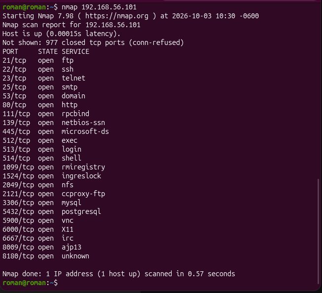

### 🚪 Evidencia 05 - Acceso autorizado vía SSH
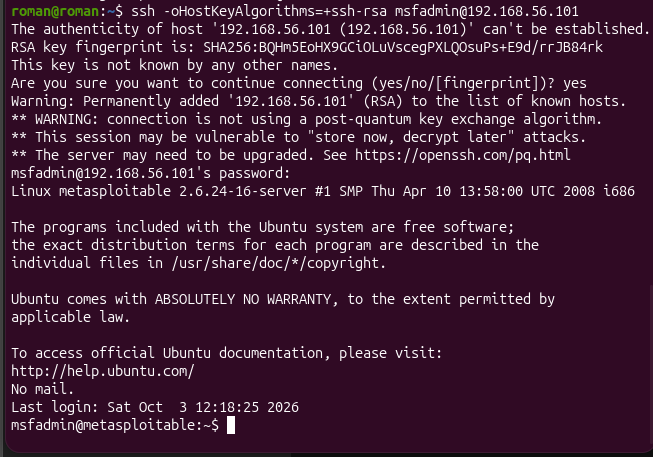

### 👤 Evidencia 06 - Identificación de usuario (whoami, id, groups)
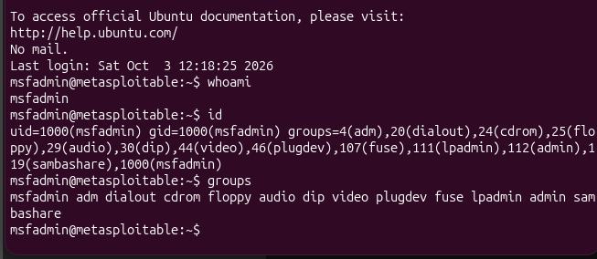

### 🔐 Evidencia 07 - Archivo de usuarios (passwd)
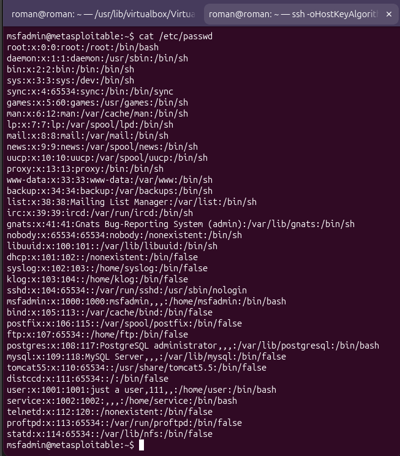

### 📁 Evidencia 08 - Análisis de permisos (ls -l)
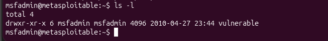

### 🗄️ Evidencia 09 - Archivo de contraseñas (shadow)
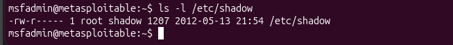

### 🚨 Evidencia 10 - Búsqueda de archivos SUID
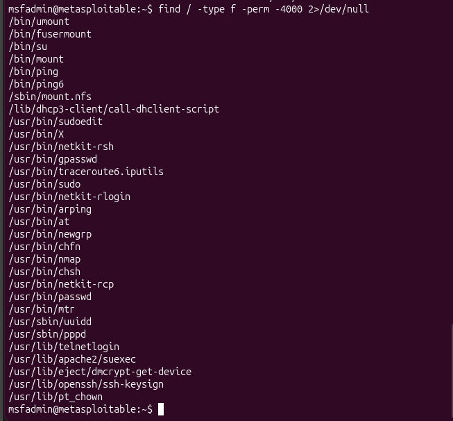

### 🧪 Evidencia 11 - Experimento de modificación de permisos (chmod)
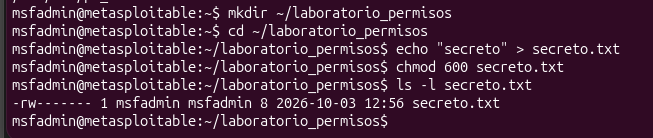

### 👥 Evidencia 12 - Creación de grupos y usuarios
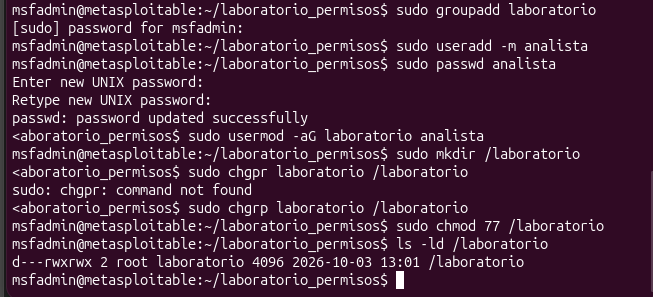

---

# 🧾 Registro de Comandos

| Comando | ¿Qué hace? | ¿Qué observé? |
|---|---|---|
| `ip addr` | Muestra la configuración de red y las IPs. | La interfaz `vboxnet0` con la dirección IP 192.168.56.1. |
| `nmap -sn` | Descubre equipos activos sin escanear puertos. | La IP 192.168.56.101 correspondiente a Metasploitable. |
| `ping` | Comprueba conectividad entre sistemas. | Respuestas exitosas (`64 bytes from...`) confirmando red. |
| `nmap` | Descubre servicios y puertos. | Una extensa lista de puertos expuestos (FTP, SSH, Telnet, VNC, BDs). |
| `ssh` | Establece conexión remota autorizada. | Acceso exitoso al servidor mostrando el prompt del usuario. |
| `whoami` | Identifica al usuario actual de la sesión. | El nombre del usuario activo: `msfadmin`. |
| `id` | Muestra el UID y GID del usuario actual. | El `uid=1000` y `gid=1000` junto con los IDs de todos sus grupos. |
| `groups` | Lista los grupos a los que pertenece el usuario. | `msfadmin adm dialout cdrom floppy audio dip video plugdev fuse lpadmin admin sambashare`. |
| `ls -l` | Lista archivos detallando permisos (r, w, x). | La estructura de permisos (`-rwxr-x---`), propietario y grupo. |
| `chmod` | Modifica los permisos de un archivo/directorio. | Restricción exitosa a permisos de lectura y escritura para el dueño (`600`). |
| `chgrp` | Cambia el grupo propietario de un archivo. | La transferencia del directorio al grupo `laboratorio`. |
| `find -perm -4000` | Busca archivos con el bit SUID activado. | Una lista de binarios que pueden ejecutarse con permisos elevados. |
